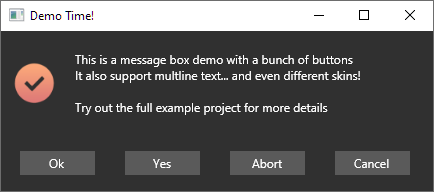

# MessageBoxSlim.Avalonia

A smaller more focused Version of  [MessageBox.Avalonia](https://github.com/CreateLab/MessageBox.Avalonia)

**NEW in 0.9.8**: User Message Box styling with a new example showcasing this new feature. Also moved another Utility class into the Root Namespace for easier access.


My goal was to build a cross-platform message box that doesn't try to be super fancy and also to remove a lot of unneeded complexity. This fork tries to create a more platform to platform default experience instand of extra features.



The major differences are:

-   Only one MessageBox Type. The removal of the custom message box is opionated but if you want custom buttons back that should be easy to add to the new class if you need it.
-   No prebaked Icons included. You can still use those from the Example but now the API expects that you have your own Icons
-   Code simplification, identifier are shorter and no longer clash with bultins
    -   Examples
        -   Show and ShowDialog are renamed to ShowAsync and ShowDialogAsync
        -   Style is now Called BoxStyle
-   A can only be constructed with the DTO Object
    -   I did this to keep things simple for now
-   The Button Parameter is now a bitfield. You can now combine every button combination you want. See the Example Project for Code Snippets.
-   Improved and simplified XAML Layout
-   Removed Header Property (Use Title instead)
-   Removed the colorful Buttons
-   A MessageBox will now by default be shown in the center of its owner
-   BitmapFactory for easy Bitmap loading from Code
-   **NEW** Custom Styling with the Avalonia Style System. All Element share the class "MessageBox". Have a look at UserThemeExample if you want to do that.


I also expanded the Example Project to show the new API and different Styles.

## Installation

You can find the latest version of this Package on [NuGet](https://www.nuget.org/packages/MessageBoxSlim.Avalonia/)

## Example Usage (Default)

```csharp
var result = await BoxedMessage.Create(new MessageBoxParams
{
	Buttons = ButtonEnum.Ok | ButtonEnum.Abort,
	ContentTitle = "Oh no",
	ContentMessage = "Oh no! Something went wrong :(",
	Location = WindowStartupLocation.CenterScreen,
	Icon = BitmapFactory.Load("avares://MessageBox.Avalonia.Example/Assets/plus.ico"),
	Style = BoxStyle.UbuntuLinux
}).ShowDialogAsync(this);
```

## Example Usage User Style

### Available Selector

-   Button.MessageBox
-   Button.MessageBox:pointerover /template/ ContentPresenter
-   Button.MessageBox:pointerover
-   TextBox.MessageBox
-   Window.MessageBox

### Example Style Rules

```xaml
        <Style Selector="Button.MessageBox">
            <Setter Property="Foreground" Value="#8fbcbb" />
            <Setter Property="Background" Value="#3b4252" />
            <Setter Property="BorderThickness" Value="2" />
        </Style>
        <Style Selector="Button.MessageBox:pointerover /template/ ContentPresenter">
            <Setter Property="Background" Value="#eceff4" />
            <Setter Property="BorderBrush" Value="#d8dee9" />
        </Style>
        <Style Selector="Button.MessageBox:pointerover">
            <Setter Property="Foreground" Value="#3b4252" />
        </Style>
        <Style Selector="TextBox.MessageBox">
            <Setter Property="Background" Value="#3b4252" />
            <Setter Property="Foreground" Value="#8fbcbb" />
        </Style>
        <Style Selector="Window.MessageBox">
            <Setter Property="Background" Value="#3b4252" />
        </Style>
```

**NOTE**: If you want to use this feature you should set the Style Property on your Message Box to None.